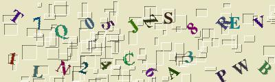
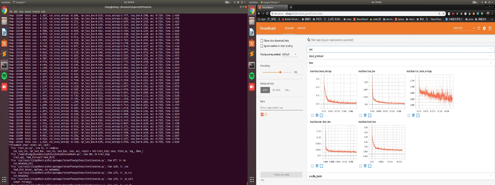
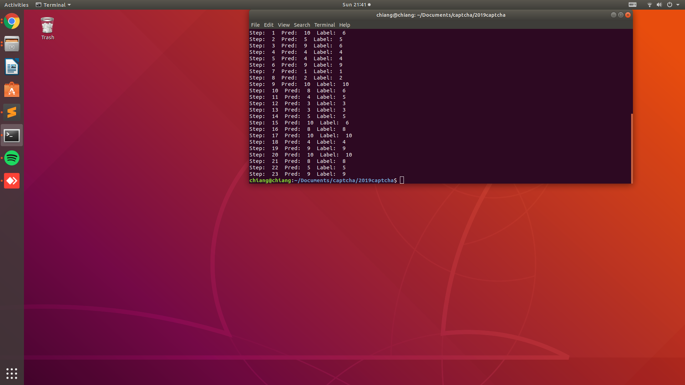
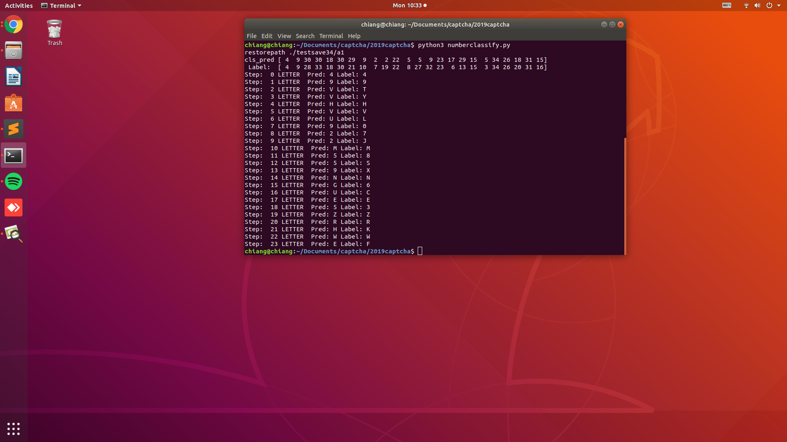

# FASTER_RCNN_IN_CAPTCHA

## 概念來源
[[心得] 以CNN實作台鐵驗證碼辨識](https://www.ptt.cc/bbs/Python/M.1514130793.A.2E1.html)

看到網友在PTT上分享CNN驗證碼辨識，自己生成圖片、簡單的CNN，高辨識率，只能感嘆粗暴卻是有力的方法；但這個方法卻不能直接辨識其他英數混合的驗證碼，因此心生一計使用Faster R-CNN 方法，先選出目標的區域，在辨識該區域的內容。
## Faster RCNN 

####  設備
|Name|Description|
|----|----|
|OS|Ubuntu 18.04|
|CPU|Intel i5-3470|
|GPU|GTX 1060 6G|
#### Data 
仿照網友提供驗證碼規則，生成英數字混合之圖片（不包含O和I）
LETTERSTR = '1234567890ABCDEFGHJKLMNPQRSTUVWXYZ'
|項目|總類|圖示|
|---|---|---|
|Train|英數字混合||
|驗證10|數字||
|驗證34|英數字混合（同Train）||

### Train 及 Tensorboard 
  
  在Train data訓練完的結果無法準確辨識該區域內容，
  * 調整模型
  * 確定NN模型英數字辨識準確率
### NN模型數字辨識
  
  
  
### 英數字混和辨識
  
  在英數字混和辨識中，準確率低
 
  
  
  

