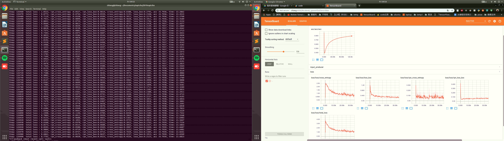

# FASTER_RCNN_IN_CAPTCHA

## 概念來源
[[心得] 以CNN實作台鐵驗證碼辨識](https://www.ptt.cc/bbs/Python/M.1514130793.A.2E1.html)

看到網友在PTT上分享CNN驗證碼辨識，自己生成圖片、簡單的CNN，高辨識率，只能感嘆簡單粗暴卻是有力的方法；但這個方法限制在該規則裡，僅能辨識5或6個英數字混合的圖片，因此心生一計使用Faster R-CNN 方法，先選出目標的區域，在辨識該區域的內容，便能識別數個英數字組合。

#### Data 說明
仿照網友提供驗證碼規則，生成英數字混合之圖片（不包含O和I） 
LETTERSTR = '1234567890ABCDEFGHJKLMNPQRSTUVWXYZ'  

|Item|part1|part2 |part3|
|:---:|:---:|:---:|:---:|
|項目名稱|[Faster RCNN](#faster-rcnn)|mnist|emnist|
|Data種類|單張image多個英數字混合|單張image單個數字或英文字|單張image單個數字或英文字|
|Train個數|1,2000張|x 張|x 張|
|圖例||||
|圖例||||
|圖例||||

## Faster RCNN 
### Faster RCNN
  Faster RCNN 分成兩個部分，第一個部分為RPN(Region Proposal Network)，另一個是 Classification；RPN是區分前景跟背景(前景即為我們有興趣的部分，背景則反之)；根據前景、背景接下來交給Classification 區分該內容物。
  
  |RPN|Classification|
  |:---:|:---:|
  |||
### Train 及 Tensorboard 
  

####  設備

|Name|Description|
|----|----|
|OS|Ubuntu 18.04|
|機器學習框架|Tensorflow-gpu1.10.1|
|CPU|Intel i5-3470|
|GPU|GTX 1060 6G|
