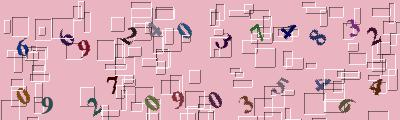
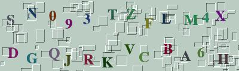
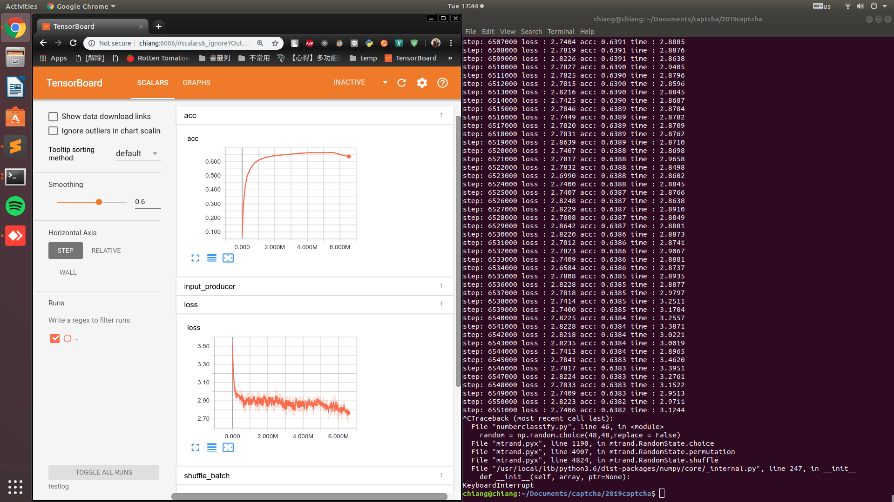

# FASTER_RCNN_IN_CAPTCHA

## 概念來源
[[心得] 以CNN實作台鐵驗證碼辨識](https://www.ptt.cc/bbs/Python/M.1514130793.A.2E1.html)

看到網友在PTT上分享CNN驗證碼辨識，自己生成圖片、簡單的CNN，高辨識率，只能感嘆粗暴卻是有力的方法；但這個方法卻不能直接辨識其他英數混合的驗證碼，因此心生一計使用Faster R-CNN 方法，先選出目標的區域，在辨識該區域的內容。

#### Data 
仿照網友提供驗證碼規則，生成英數字混合之圖片（不包含O和I） 
LETTERSTR = '1234567890ABCDEFGHJKLMNPQRSTUVWXYZ'

|Item|part1|part2|part3|part4|
|:---:|:---:|:---:|:---:|:---:|
|項目名稱|[Faster RCNN](#faster-rcnn)|[數字辨識](#數字辨識)|[英數字混和辨識](#英數字混和辨識)|[英數字未旋轉](#英數字未旋轉)|
|Data種類|英數字混合|數字|英數字混合（同part1）|英數字混合(英數字未旋轉)|
|Train個數|1,2000張|30,000張|35,000張|37,000張|
|圖例|||||

## Faster RCNN 
### Faster RCNN
  Faster RCNN 分成兩個部分，第一個部分為RPN(Region Proposal Network)，另一個是 Classification；RPN是區分前景跟背景(前景即為我們有興趣的部分，背景則反之)；根據前景、背景接下來交給Classification 區分該內容物。
  
  |RPN|Classification|
  |:---:|:---:|
  |||
### Train 及 Tensorboard 
  
  在Train data訓練完的結果無法準確辨識該區域內容(即Classification表現不好)，僅能分辨前景、背景，接下來能做的有:
  * 調整模型
  * 確定Classification(NN模型)英數字辨識準確率
## NN模型
### 數字辨識
  首先縮減資料難度，僅使用數字的部分，訓練後結果顯著，正確率高
   
### 英數字混和辨識
  
  英數字混和訓練中，正確率只有0.35左右
  
  Test結果如下，正確率不高
  
### 英數字未旋轉
  訓練結果
  
  Test結果
  

####  設備

|Name|Description|
|----|----|
|OS|Ubuntu 18.04|
|機器學習框架|Tensorflow-gpu1.10.1|
|CPU|Intel i5-3470|
|GPU|GTX 1060 6G|
